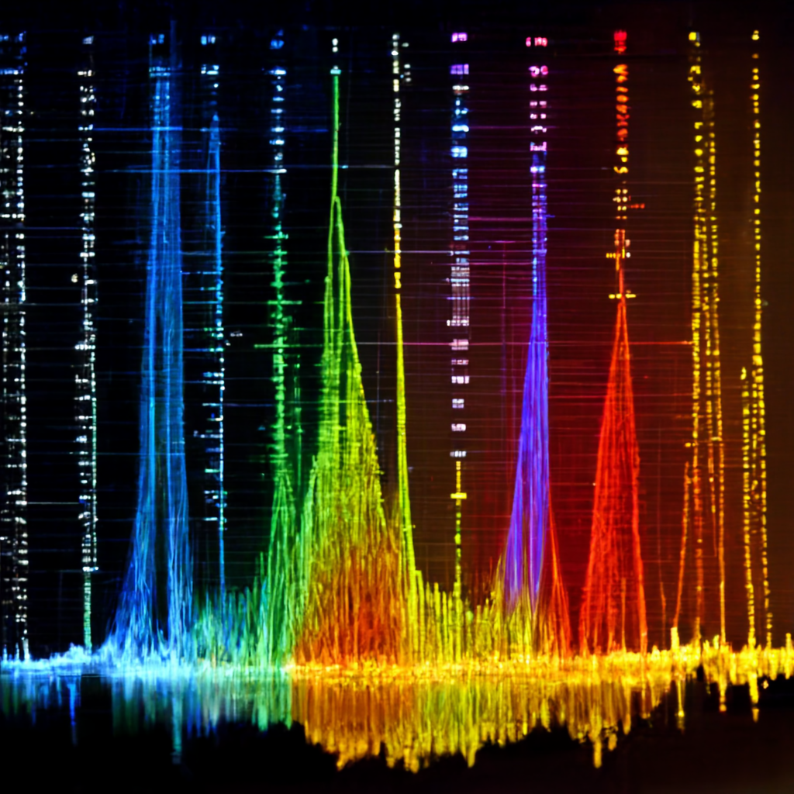

# Tinnitus reconstruction via reverse correlation

This project works to develop a method for characterizing the sounds 
experienced by tinnitus patients with potential for characterizing a 
wider range of sounds than currently possible. 
The approach is based on reverse correlation, an established behavioral 
method widely used in psychophysics for unconstrained 
characterization of internal perceptual representations.

